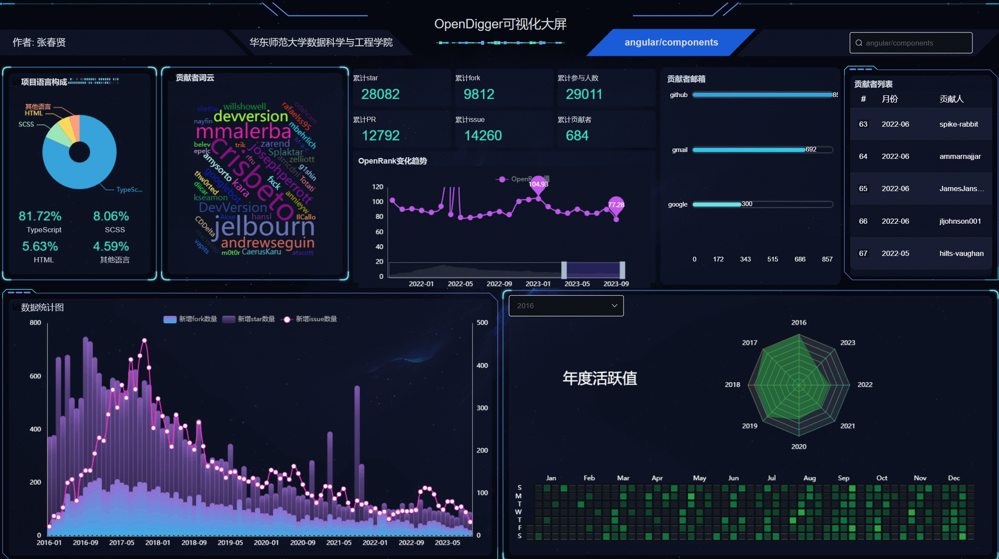
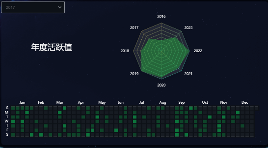
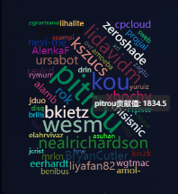
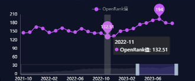
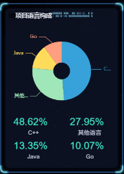
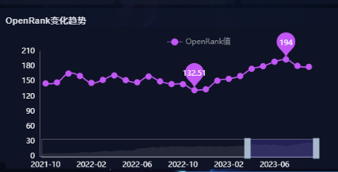
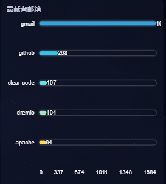
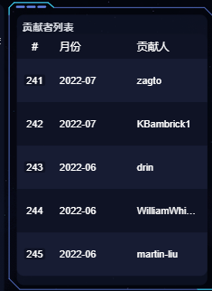
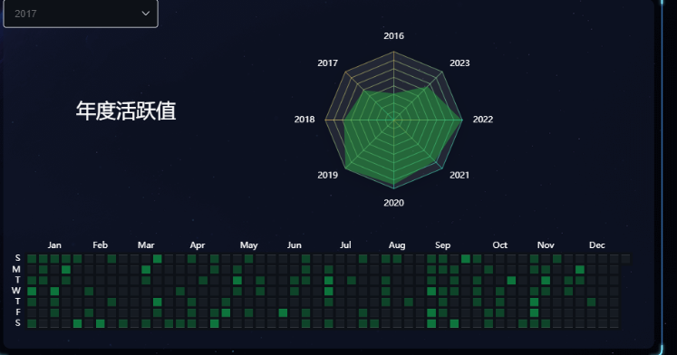

<div align="center">
<h1 >
  <br/>OpenDigger Big Screen
</h1>


[](README-CN.md)


The Big Screen is developed by Unsupervised Learning Group in [OpenSODA](https://competition.atomgit.com/competitionInfo?id=bc6603e0b8bf11ed804e6b78b4426d45) competition.

## About this project

An online accessible, interactive visualization screen. Data from X-lab2017/open-digger and Github API.

The project is powered 🚀 by Vue, and is available online at:   [http://open-digger.com/#/](http://open-digger.com/#/)

## How to view ?

### Demo video

https://www.bilibili.com/video/BV1Nh4y1r7Gt/

+ All you need to do is just to type in the address http://open-digger.com/#/ into your browser and you can access it online!

### Docker deployment

1. Install Docker: Make sure Docker is installed on your system. they can follow the instructions in the official documentation: https://docs.docker.com/get-docker/

2. Pull images: You can pull uploaded images from Docker Hub using the following command

   docker image address : https://hub.docker.com/repository/docker/beinvisibling/opendiggerbigscreen/general

      ```bash
      docker pull beinvisibling/opendiggerbigscreen:latest
      ```

     This will download and store your image from Docker Hub on their local system.

3. Run the container: you can run your image using the following command:

      ```bash
      docker run -d -p 8081:8081 your-dockerhub-username/your-image-name
      ```

      - The `-d` flag indicates to run the container in the background.
      - The ``-p 8080:3000`` flag maps the container's port 8081 to the host's port 8081.This assumes that your Node.js application is using port 8081 in the container.

4. accessing the application: once the container is running, you can access your Node.js application by going to `http://localhost:8081` in your browser. If you have mapped the container port on another port on the host, you need to change the port number in the URL accordingly.

This way, you will be able to run and access the OpenDigger l big screen application image on their local system. You can use the `docker stop container-id` command, where `container-id` is the ID of the container, which can be viewed using the `docker ps` command.

### Github repository clone

Address: https://github.com/ZhangChunXian/OpenDiggerBigScreen

Thanks to the high quality of the OpenDigger visualization and my social media campaigns, the star is now at 55 !


+ Clone the github repository locally

  ```bash
  git clone https://github.com/ZhangChunXian/OpenDiggerBigScreen.git
  

+ npm installs the package, node version 15.14.0 is recommended.

  ```bash
  cd OpenDiggerBigScreen
  npm install
  ```

+ npm to run on port 8080 by default.

  ```bash
  npm run serve 
  ```

## Introduction to the OpenDigger Visualization Screen

### Scenario and meaning

The world needs open source, open source needs to be seen by more people, more people to participate in open source. This project jumps out of the general sense of open source from the code point of view, choose from the visual angle easier for the public to understand and receive, to attract the attention of the audience, from the perspective of the visualization of the big screen to promote open source, easier for ordinary people to understand and accept. Because ordinary people, even if they do not know code and programming, can participate in open source.

### Realization

The data of this big screen comes from 

- [X-lab2017](https://github.com/X-lab2017)
- [Github API](https://docs.github.com/en/rest)

Technology stack: Vue 2.6 Echarts 5.3 RestFul API

### Description of the work

The thumbnail of the whole big screen is as follows, including some dynamic actions


### Characteristics of the work

#### Data from a wide range of sources

The data for this large screen comes from 

- [X-lab2017](https://github.com/X-lab2017)
- [Github API](https://docs.github.com/en/rest)

The API of X-Lab2017 contains information about a wide variety of open source projects, as follows


The Github API also allows you to find additional information, such as a map of the project's language distribution.

#### Dynamic Interactive Queries

## Websites are dynamic and interactive!

## Websites are dynamically variable and interactive!

## Websites are dynamic and interactive!

Unlike the general visualization of the big screen, this project can be queried , according to different open source projects to show different interfaces , we can according to the project author and project name of the project memory visualization query .

The query action is as follows



Entering a query, such as **apache/arrow** , will switch the chart from the other repository.


And under each project you can check the activity for the corresponding year

**apache/arrow** activity in 2016


**apache/arrow** activity in 2017



#### Interactive charts

Each chart, when you mouse over it, can be operated, such as wave scrolling, list scrolling, value display, zoom, etc.






### Graphical interpretation

#### **Project Language Composition**

You can find out the language composition of a project by querying the Github API to get a basic understanding of the project's technology stack.



#### Contributor Word Cloud

You can view the word cloud to understand the contribution of the open source big brother, the larger the word means more contributions


#### Project Information

Check your project's star, fork, participants, issue, and contributors.


#### OpenRank Trends

openRank is an open source project metric created by OpenDigger, and this screen shows its trend.



#### Contributor Email

Through the list of contributors' e-mail, you can find out some information about the nationality of the contributors. For example, gmail is usually for Europeans and Americans, 163 and qq are usually for Chinese.



#### List of contributors

Check out the list of contributing bigwigs! And it's a scrolling list!



#### Statistic Chart

From the star, fork and issue additions perspective, to see the popularity of an open source project, the higher the three the more popular!


#### Annual Activity Map

Imitate Github heatmap, open to see the project's update status!

Radar chart to see the annual activity of the project, so you can better understand the open source project!



### Competition Takeaways

Gained a complete visualization project experience, from start to finish, planning how to better present the open source project, to help open source.

